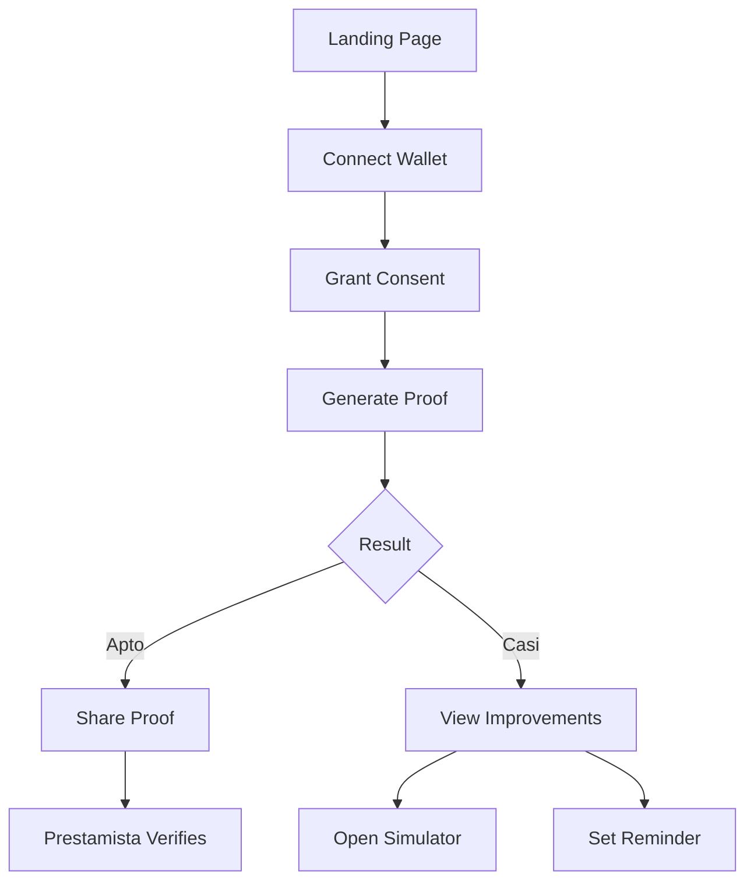

# Product Requirements Document (PRD)
## PrivyCredit - Zero-Knowledge Credit Proof System

**Version:** 1.0
**Last Updated:** 28 de Octubre, 2025
**Product Owner:** PrivyCredit Team
**Status:** MVP Development

---

## 1. Executive Summary

### 1.1 Product Vision
PrivyCredit es una plataforma de verificación crediticia basada en blockchain que permite a los usuarios demostrar su solvencia financiera sin revelar información personal identificable (PII), montos específicos o contrapartes. Utilizando pruebas de conocimiento cero (ZK proofs) y tecnología blockchain, transformamos la forma en que individuos acceden a crédito manteniendo su privacidad.

### 1.2 Problem Statement
Los sistemas tradicionales de evaluación crediticia requieren:
- Exposición completa de información financiera personal
- Revelación de montos exactos de transacciones
- Divulgación de contrapartes comerciales
- Pérdida de control sobre datos personales
- Procesos lentos y burocráticos

### 1.3 Solution
PrivyCredit ofrece:
- **Pruebas selladas** que verifican solvencia sin exponer datos sensibles
- **Bandas de evaluación** (A/B/C) en lugar de números exactos
- **Registro inmutable** en Scroll Sepolia blockchain
- **Control total** del usuario sobre sus pruebas
- **Verificación instantánea** para prestamistas

### 1.4 Target Users
- **Usuarios finales**: Individuos que buscan crédito manteniendo privacidad
- **Prestamistas**: Instituciones financieras, cooperativas, fintechs
- **Verificadores**: Entidades que necesitan validar solvencia sin acceso a PII

---

## 2. Product Goals & Success Metrics

### 2.1 Business Goals
- Democratizar el acceso al crédito mediante privacidad
- Reducir el tiempo de evaluación crediticia de días a minutos
- Aumentar la confianza entre usuarios y prestamistas
- Crear un estándar de privacidad en servicios financieros

### 2.2 Key Performance Indicators (KPIs)
| Métrica | Target | Measurement |
|---------|--------|-------------|
| Pruebas generadas | 1,000/mes | Smart contract events |
| Tiempo de generación | < 2 minutos | Client-side tracking |
| Tasa de verificación exitosa | > 95% | Backend analytics |
| Satisfacción de usuario | > 4.5/5 | In-app surveys |
| Adopción por prestamistas | 10 instituciones | Partnership tracking |

### 2.3 Success Criteria
- ✅ Generación de pruebas funcional en testnet
- ✅ Sistema de bandas (A/B/C) implementado
- ✅ Interfaz de usuario completa y responsive
- ✅ Portal de verificación B2B operativo
- ⏳ Integración con al menos 3 prestamistas
- ⏳ Auditoría de seguridad completada

---

## 3. Technical Architecture

### 3.1 Technology Stack

#### Blockchain Layer
- **Network**: Scroll Sepolia Testnet (Chain ID: 534351)
- **Smart Contract**: ZKCreditProofDemo.sol
  - Address: `0x017Ee1cf9fd610b0D2a264bca1dec9Efe0d8b778`
  - Functions: submitProof, getProofSummary, verifyBands, revokeProof
- **Libraries**: viem 2.38.4

#### Frontend
- **Framework**: React 18.3.1 + TypeScript 5.5.3
- **Build Tool**: Vite 5.4.2
- **Styling**: Tailwind CSS 3.4.1
- **UI Components**: Lucide React 0.344.0
- **State Management**: React Context API
- **Web3**: viem, custom wallet integration

#### Backend & Data
- **Database**: Supabase PostgreSQL
- **Authentication**: Wallet-based (MetaMask, WalletConnect)
- **Storage**: On-chain (proof metadata), Off-chain (user preferences)

### 3.2 Smart Contract Architecture

```solidity
// Core Data Structures
enum Band { A, B, C }

struct Factors {
    Band stability;   // Consistencia de saldos
    Band inflows;     // Ingresos recurrentes
    Band risk;        // Gestión de volatilidad
}

struct Proof {
    address user;
    uint64 epoch;
    bytes32 commitment;
    Factors factors;
    bool valid;
    uint64 createdAt;
}
```

#### Key Functions
1. **submitProof**: Registra una nueva prueba con bandas calculadas
2. **getProofSummary**: Recupera información de una prueba
3. **verifyBands**: Valida si una prueba cumple umbrales mínimos
4. **revokeProof**: Invalida una prueba existente
5. **anchorRoot**: Registra raíz Merkle para época

### 3.3 Database Schema (Supabase)

```sql
-- Tabla principal de pruebas
CREATE TABLE proofs (
    id uuid PRIMARY KEY DEFAULT gen_random_uuid(),
    user_id text NOT NULL,
    blockchain_proof_id text UNIQUE NOT NULL,
    tx_hash text,
    status text CHECK (status IN ('apto', 'casi')),
    factors jsonb NOT NULL,
    anchor_root text,
    epoch bigint,
    created_at timestamptz DEFAULT now(),
    expires_at timestamptz,
    share_link text UNIQUE
);

-- Tabla de mejoras sugeridas
CREATE TABLE improvements (
    id uuid PRIMARY KEY DEFAULT gen_random_uuid(),
    proof_id uuid REFERENCES proofs(id),
    factor text NOT NULL,
    action text NOT NULL,
    impact text CHECK (impact IN ('alto', 'medio', 'bajo')),
    completed boolean DEFAULT false
);

-- Tabla de recordatorios
CREATE TABLE reminders (
    id uuid PRIMARY KEY DEFAULT gen_random_uuid(),
    user_id text NOT NULL,
    reminder_date timestamptz NOT NULL,
    status text DEFAULT 'pending',
    created_at timestamptz DEFAULT now()
);

-- RLS Policies
ALTER TABLE proofs ENABLE ROW LEVEL SECURITY;
ALTER TABLE improvements ENABLE ROW LEVEL SECURITY;
ALTER TABLE reminders ENABLE ROW LEVEL SECURITY;
```

### 3.4 Design System

#### Color Palette
- **Primary/Accent**: `#A6DD05` - Verde lima (CTAs, highlights)
- **Light**: `#F1F1F1` - Gris claro (textos principales)
- **Dark Card**: `#2D2D2D` - Gris medio (tarjetas, contenedores)
- **Dark Background**: `#171717` - Negro carbón (fondo principal)
- **Status Colors**:
  - Green: `#10b981` (Apto, éxito)
  - Yellow: `#f59e0b` (Casi, advertencia)
  - Red: `#ef4444` (Error, rechazo)

#### Typography
- **Font Family**: Poppins (300, 400, 500, 600, 700)
- **Headings**: Bold, 600-700 weight
- **Body**: Regular, 400 weight
- **Scale**:
  - H1: 3-4rem
  - H2: 2rem
  - Body: 1rem
  - Small: 0.875rem

#### Spacing & Layout
- **Base Unit**: 8px
- **Container Max Width**:
  - Mobile: Full width (padding 1rem)
  - Tablet: 768px
  - Desktop: 1280px
- **Border Radius**:
  - Small: 0.5rem
  - Medium: 1rem
  - Large: 1.5rem
  - XL: 2rem

---

## 4. Feature Specifications

### 4.1 User Flow - Core Journey



### 4.2 Feature Details

#### Feature 1: Landing Page
**Priority**: P0 (Must Have)
**Status**: ✅ Implemented

**Requirements**:
- [x] Hero section con tagline "Crédito sin destapar tu vida"
- [x] 3-step process explanation (Conecta, Genera, Responde)
- [x] Trust indicators (aliados, contrato verificado)
- [x] CTA prominente "Probar ahora"
- [x] Network information (Scroll Sepolia)
- [x] Link a explorador de blockchain

**Acceptance Criteria**:
- Carga en < 2 segundos
- Responsive desde 320px hasta 1920px
- Accesible (WCAG 2.1 AA)
- CTA visible above the fold en móvil

---

#### Feature 2: Connect Wallet + Consent
**Priority**: P0 (Must Have)
**Status**: ✅ Implemented

**Requirements**:
- [x] Detección automática de wallet (MetaMask)
- [x] Validación de red (Scroll Sepolia)
- [x] Switch automático de red
- [x] Agregar red si no existe
- [x] Consent explícito con checkboxes:
  - Analizar actividad on-chain
  - Generar prueba sellada sin PII
- [x] Enlaces a T&C y Privacy Policy
- [x] Ayuda contextual "¿Qué es una prueba sellada?"

**Technical Specifications**:
```typescript
interface ConsentData {
  dataAnalysis: boolean;
  proofGeneration: boolean;
  timestamp: number;
  wallet: string;
}
```

**Error Handling**:
- Red incorrecta → Prompt para cambiar
- Wallet no detectada → Instrucciones de instalación
- Rechazo de firma → Mensaje amable, opción de reintentar

**Acceptance Criteria**:
- Solo permite continuar con ambos consents marcados
- Persiste consent en localStorage
- Maneja errores de conexión gracefully

---

#### Feature 3: Generate Proof (Progress)
**Priority**: P0 (Must Have)
**Status**: ✅ Implemented

**Requirements**:
- [x] UI de progreso en 4 etapas:
  1. Recopilando señales (~25%)
  2. Sellando la prueba ZK (~50%)
  3. Anclando en blockchain (~75%)
  4. Listo (100%)
- [x] Barra de progreso visual
- [x] Estimado de tiempo (30-60 segundos)
- [x] Microcopy educativo
- [x] Cancelación disponible
- [x] Loading states accesibles

**Technical Flow**:
```typescript
// 1. Generar factores mock (simulación)
const factors = calculateFactors(walletHistory);

// 2. Crear commitment
const commitment = keccak256(JSON.stringify(factors));

// 3. Submitir a smart contract
const tx = await contract.submitProof(
  proofId,
  epoch,
  commitment,
  factors.stability,
  factors.inflows,
  factors.risk
);

// 4. Esperar confirmación
await tx.wait();
```

**Error Handling**:
- Transaction rejected → Explicar y ofrecer reintento
- Red incorrecta → Redirigir a cambio de red
- Timeout → Verificar estado en blockchain

**Acceptance Criteria**:
- Completa en < 2 minutos el 95% de las veces
- Muestra estados intermedios cada 5 segundos
- Permite cancelar antes de submitir tx

---

#### Feature 4: Result Card - Apto
**Priority**: P0 (Must Have)
**Status**: ✅ Implemented

**Requirements**:
- [x] Indicador visual de éxito (check verde)
- [x] Título "¡Apto!"
- [x] Bandas por factor en chips:
  - Estabilidad: A/B/C
  - Inflows: A/B/C
  - Riesgo: A/B/C
- [x] Explicación de cada factor
- [x] CTAs principales:
  - "Compartir con prestamista" (primary)
  - "Ver detalles" (secondary)
- [x] Info de prueba (ID, válida hasta, tx hash)
- [x] Nota de privacidad

**Band Display Logic**:
```typescript
const getBandColor = (band: 'A' | 'B' | 'C') => {
  switch (band) {
    case 'A': return 'green'; // #10b981
    case 'B': return 'yellow'; // #f59e0b
    case 'C': return 'red'; // #ef4444
  }
};
```

**Acceptance Criteria**:
- Todos los factores visibles sin scroll en móvil
- Link a tx en Scroll Sepolia Explorer funcional
- Botón "Compartir" genera enlace único

---

#### Feature 5: Result Card - Casi
**Priority**: P0 (Must Have)
**Status**: ✅ Implemented

**Requirements**:
- [x] Tono empático ("Casi allí")
- [x] Bandas actuales mostradas
- [x] 3 mejoras priorizadas por impacto:
  - Factor afectado
  - Acción sugerida
  - Nivel de impacto (Alto/Medio/Bajo)
- [x] CTAs:
  - "Abrir simulador" (primary)
  - "Recordarme en 30 días" (secondary)
- [x] Botón "Ver lista completa de mejoras"

**Improvement Suggestions Logic**:
```typescript
interface Improvement {
  factor: 'Estabilidad' | 'Inflows' | 'Riesgo';
  action: string;
  impact: 'Alto' | 'Medio' | 'Bajo';
  description: string;
}

// Priorización: Alto > Medio > Bajo
// Top 3 mostradas en resultado
```

**Acceptance Criteria**:
- Mensaje motivador, no punitivo
- Acciones específicas y accionables
- Guía a simulador o recordatorio

---

#### Feature 6: Share Proof / Export
**Priority**: P0 (Must Have)
**Status**: ✅ Implemented

**Requirements**:
- [x] Generación de enlace único con expiración
- [x] QR code para escaneo rápido
- [x] Contador de días hasta expiración
- [x] Botón "Copiar enlace" con feedback
- [x] Lista de aliados para envío directo
- [x] Información compartida claramente especificada

**Link Structure**:
```
https://privycredit.app/verify/{blockchain_proof_id}
```

**Security**:
- Enlace expira en 30 días por defecto
- No incluye PII en URL
- Verificación requiere lectura de blockchain

**Acceptance Criteria**:
- Enlace copiable con un click
- QR escaneable con apps estándar
- Muestra qué se comparte exactamente
- Permite regenerar si expira

---

#### Feature 7: Improvement Checklist
**Priority**: P1 (Should Have)
**Status**: ✅ Implemented

**Requirements**:
- [x] Lista accionable de mejoras
- [x] Cada item incluye:
  - Factor afectado
  - Acción específica
  - Descripción en una línea
  - Etiqueta de impacto
- [x] CTAs:
  - "Guardar plan" (descarga/almacena)
  - "Activar recordatorio"
- [x] Tono motivador

**Data Structure**:
```typescript
interface ChecklistItem {
  id: string;
  factor: string;
  action: string;
  description: string;
  impact: 'Alto' | 'Medio' | 'Bajo';
  completed: boolean;
}
```

**Acceptance Criteria**:
- Máximo 5 items para no abrumar
- Priorizados por impacto
- Opción de marcar como completado

---

#### Feature 8: Simulator (Bandas)
**Priority**: P1 (Should Have)
**Status**: ✅ Implemented

**Requirements**:
- [x] Controles interactivos por factor
- [x] Sliders/toggles para cambiar bandas
- [x] Resultado actualizado en tiempo real
- [x] Indicador Apto/Casi dinámico
- [x] Botón "Reset" a valores actuales
- [x] Explicación de cálculo

**Calculation Logic**:
```typescript
const calculateStatus = (factors: Factors): 'apto' | 'casi' => {
  const scores = { A: 3, B: 2, C: 1 };
  const total = scores[factors.stability] +
                scores[factors.inflows] +
                scores[factors.risk];
  return total >= 8 ? 'apto' : 'casi';
};
```

**Acceptance Criteria**:
- Respuesta instantánea (< 100ms)
- No usa datos reales del usuario
- Educativo: explica factores sin tecnicismos

---

#### Feature 9: Reminders
**Priority**: P2 (Nice to Have)
**Status**: ✅ Implemented

**Requirements**:
- [x] Opciones de periodo: 15, 30, 60, 90 días
- [x] Confirmación visual con fecha exacta
- [x] Microcopy cercano
- [x] Opción de cancelar

**Technical Implementation**:
```typescript
interface Reminder {
  id: string;
  user_id: string;
  reminder_date: Date;
  status: 'pending' | 'sent' | 'cancelled';
  created_at: Date;
}

// Trigger: Cron job daily check
// Channel: In-app notification (MVP)
// Future: Email, Push notifications
```

**Acceptance Criteria**:
- Fecha calculada y mostrada correctamente
- Persistida en database
- Confirmación visual al activar

---

#### Feature 10: Verifier Gate (B2B)
**Priority**: P0 (Must Have)
**Status**: ✅ Implemented

**Requirements**:
- [x] Input para ID de prueba o enlace
- [x] Opción de escanear QR
- [x] Botón "Verificar ahora"
- [x] Estados de verificación:
  - En proceso
  - Token inválido
  - Token expirado
  - Verificación exitosa
- [x] Explicación clara de qué se verá

**Verification Flow**:
```typescript
// 1. Extraer proof ID del input/QR
const proofId = extractProofId(input);

// 2. Query smart contract
const proof = await contract.getProofSummary(proofId);

// 3. Validar estado
if (!proof.valid) {
  return { status: 'invalid', reason: 'revoked' };
}

// 4. Mostrar resultado
return {
  status: 'valid',
  factors: proof.factors,
  metadata: { epoch, createdAt, user }
};
```

**Acceptance Criteria**:
- Verifica en < 5 segundos
- Maneja errores de red gracefully
- No expone PII del usuario

---

#### Feature 11: Verification Result (B2B)
**Priority**: P0 (Must Have)
**Status**: ✅ Implemented

**Requirements**:
- [x] Veredicto claro (OK/Fail)
- [x] Bandas por factor con código de color
- [x] Metadatos sin PII:
  - Proof ID
  - Timestamp
  - Epoch
  - Usuario (wallet address)
- [x] CTAs:
  - "Solicitar underwriting con PII" (off-chain)
  - "Descargar constancia" (PDF/CSV)
  - "Cerrar"

**Constancia Format** (Future):
```
PrivyCredit Verification
------------------------
Proof ID: 0x...
Status: VALID
Created: 2025-10-28
Factors:
  - Stability: A
  - Inflows: A
  - Risk: B

This proof demonstrates creditworthiness
without exposing personal information.
```

**Acceptance Criteria**:
- Decisión clara y rápida
- Trazabilidad mínima
- Cero exposición de montos/contrapartes

---

#### Feature 12: Network Alert
**Priority**: P0 (Must Have)
**Status**: ✅ Implemented

**Requirements**:
- [x] Detección automática de red incorrecta
- [x] Alert flotante en top-center
- [x] Botón para cambiar a Scroll Sepolia
- [x] Opción de dismissar temporalmente
- [x] Reaparece si cambia a red incorrecta nuevamente

**Acceptance Criteria**:
- Detección instantánea al conectar wallet
- Cambio de red con un click
- No bloquea interacción con UI

---

#### Feature 13: Footer Informativo
**Priority**: P2 (Nice to Have)
**Status**: ✅ Implemented

**Requirements**:
- [x] Logo/nombre de PrivyCredit
- [x] Indicador de red actual
- [x] Link a smart contract
- [x] Estado de conexión visual

**Acceptance Criteria**:
- Visible en todas las pantallas
- Links funcionales
- Diseño minimalista

---

## 5. User Stories

### Persona 1: María - Freelancer
**Demografía**: 32 años, diseñadora freelance, gana $2,000/mes en crypto
**Pain Points**:
- Bancos tradicionales rechazan su solicitud por falta de nómina
- No quiere compartir todos sus clientes ni montos exactos
- Necesita crédito para equipo nuevo

**User Stories**:
1. Como María, quiero demostrar que tengo ingresos estables sin revelar mis clientes, para obtener un préstamo de $5,000
2. Como María, quiero ver qué mejorar en mi perfil financiero para ser aprobada en el futuro
3. Como María, quiero que me recuerden en 60 días cuando haya mejorado mi estabilidad

**Success Scenario**:
María conecta su wallet, genera una prueba mostrando banda A en inflows y B en estabilidad. Comparte el enlace con una fintech que aprueba su préstamo en 2 horas sin solicitar más documentos.

---

### Persona 2: Carlos - Prestamista en Cooperativa
**Demografía**: 45 años, gerente de crédito, evalúa 50+ solicitudes/semana
**Pain Points**:
- Proceso manual de verificación toma 3-5 días
- Difícil validar solvencia de trabajadores informales
- Alto riesgo de fraude con documentos

**User Stories**:
1. Como Carlos, quiero verificar una prueba de crédito en menos de 5 minutos para acelerar aprobaciones
2. Como Carlos, quiero ver solo bandas de evaluación sin acceder a información sensible del cliente
3. Como Carlos, quiero descargar una constancia de verificación para el expediente

**Success Scenario**:
Un solicitante llega con un QR de PrivyCredit. Carlos escanea, ve bandas A/A/B, aprueba un préstamo pequeño inmediatamente. Para montos mayores, solicita underwriting completo solo si es necesario.

---

### Persona 3: Ana - Early Adopter DeFi
**Demografía**: 28 años, trader de crypto, portafolio de $50k
**Pain Points**:
- Quiere privacidad pero necesita crédito tradicional
- Frustrada con KYC invasivo
- Busca soluciones tech-forward

**User Stories**:
1. Como Ana, quiero probar el sistema en testnet antes de usar mi wallet principal
2. Como Ana, quiero simular diferentes escenarios para entender el scoring
3. Como Ana, quiero compartir mi prueba con múltiples prestamistas sin duplicar datos

**Success Scenario**:
Ana usa el simulador para entender qué factores afectan su banda. Genera una prueba, la comparte con 3 fintechs. Recibe 2 ofertas de crédito en 24 horas sin compartir su wallet address real.

---

## 6. Non-Functional Requirements

### 6.1 Performance
| Requirement | Target | Critical? |
|-------------|--------|-----------|
| Page Load Time | < 2s | Yes |
| Proof Generation | < 2min | Yes |
| Verification Time | < 5s | Yes |
| Time to Interactive | < 3s | No |
| Bundle Size | < 500KB (gzipped) | No |

**Current Status**:
- Bundle: 469KB ✅
- CSS: 18KB ✅

### 6.2 Security
- **Wallet Security**: No private keys stored, all signing client-side
- **Smart Contract**: Auditable, open-source, immutable
- **Data Privacy**:
  - No PII in blockchain
  - No tracking cookies
  - Consent-based data processing
- **Link Security**: Expiration, no sensitive data in URL
- **RLS Policies**: Enabled on all Supabase tables

### 6.3 Scalability
- **Smart Contract**: Gas-optimized, batch operations supported
- **Frontend**: Static generation, CDN-ready
- **Database**: Indexed queries, connection pooling
- **Target Load**:
  - 10,000 proof generations/day
  - 50,000 verifications/day
  - 100 concurrent users

### 6.4 Accessibility
- **WCAG 2.1 Level AA** compliance
- **Keyboard Navigation**: All features accessible
- **Screen Readers**: ARIA labels, semantic HTML
- **Color Contrast**: 4.5:1 minimum for text
- **Focus Indicators**: Visible on all interactive elements

### 6.5 Browser Support
| Browser | Version | Support Level |
|---------|---------|---------------|
| Chrome | 90+ | Full |
| Firefox | 88+ | Full |
| Safari | 14+ | Full |
| Edge | 90+ | Full |
| Mobile Safari | 14+ | Full |
| Mobile Chrome | 90+ | Full |

### 6.6 Internationalization (Future)
- Primary: Español (MX)
- Phase 2: English (US)
- Phase 3: Portuguese (BR)

---

## 7. Technical Constraints & Assumptions

### 7.1 Constraints
1. **Testnet Only**: MVP operates on Scroll Sepolia, no mainnet deployment
2. **MetaMask Required**: Primary wallet, others not supported in MVP
3. **Mock Factors**: Credit scoring is simulated, not connected to real data sources
4. **No Real Integrations**: Prestamista connections are UI placeholders
5. **Manual QR**: QR generation not implemented, shows text link only

### 7.2 Assumptions
1. Users have basic crypto knowledge (wallet setup)
2. Users have ETH in Scroll Sepolia for gas (faucet available)
3. Prestamistas willing to adopt blockchain verification
4. Regulatory approval for ZK-based credit scoring
5. On-chain data sufficient for creditworthiness assessment

### 7.3 Dependencies
- **External**: MetaMask extension, Scroll Sepolia RPC, Google Fonts
- **Internal**: Supabase project, Vercel/hosting, Domain registration
- **Third-party**: viem library, Tailwind CSS, Lucide icons

---

## 8. Roadmap & Phases

### Phase 1: MVP (Current) - Testnet Demo ✅
**Timeline**: Complete
**Scope**:
- [x] All 11 user-facing screens
- [x] Smart contract deployed to Scroll Sepolia
- [x] Wallet connection & consent
- [x] Mock proof generation
- [x] B2B verification portal
- [x] Design system implementation

**Deliverables**:
- Functional demo on testnet
- Source code repository
- Basic documentation

---

### Phase 2: Real Data Integration 🚧
**Timeline**: Q1 2026
**Scope**:
- [ ] Connect to real wallet transaction history
- [ ] Implement actual credit scoring algorithm
- [ ] Add data source connectors (exchanges, DEXs)
- [ ] Privacy-preserving computation layer
- [ ] Smart contract audit

**Deliverables**:
- Production-ready scoring engine
- Audited smart contracts
- Data provider integrations

---

### Phase 3: Prestamista Partnerships 📋
**Timeline**: Q2 2026
**Scope**:
- [ ] Partner with 3-5 fintechs/cooperativas
- [ ] Build API for direct integrations
- [ ] Whitelabel verification widget
- [ ] Webhook notifications for verifications
- [ ] Analytics dashboard for partners

**Deliverables**:
- Partner API documentation
- SDK for integrations
- 3+ live partnerships

---

### Phase 4: Mainnet & Scale 🎯
**Timeline**: Q3 2026
**Scope**:
- [ ] Deploy to Scroll Mainnet
- [ ] Implement paid tier for prestamistas
- [ ] Add email/push notifications
- [ ] Multi-wallet support
- [ ] Mobile app (React Native)
- [ ] Regional expansion (LATAM)

**Deliverables**:
- Mainnet deployment
- Revenue-generating product
- 1,000+ monthly active users

---

## 9. Open Questions & Risks

### 9.1 Open Questions
1. **Regulatory**: ¿Qué licencias necesitamos para operar en México?
2. **Scoring**: ¿Qué factores on-chain son realmente predictivos de solvencia?
3. **Adoption**: ¿Cómo convencer a prestamistas tradicionales de confiar en blockchain?
4. **Pricing**: ¿Modelo freemium o fee por verificación?
5. **Privacy**: ¿Cómo balancear privacidad con requisitos KYC/AML?

### 9.2 Risks & Mitigation

| Risk | Probability | Impact | Mitigation |
|------|-------------|--------|------------|
| Bajo adoption de prestamistas | High | High | Piloto con 1-2 partners early, probar value prop |
| Scoring no predictivo | Medium | High | Benchmark contra bureaus tradicionales, iterar |
| Vulnerabilidad en smart contract | Low | Critical | Auditoría profesional, bug bounty, insurance |
| Baja adopción de usuarios | Medium | High | Marketing educativo, UX simplificada, incentivos |
| Cambios regulatorios | Medium | Medium | Legal counsel, compliance proactivo, flexibilidad |
| Gas fees prohibitivos | Low | Medium | Scroll L2 es barato, considerar subsidio inicial |

### 9.3 Technical Debt
- Mock data en lugar de scoring real
- Sin tests unitarios/e2e
- Hardcoded strings (no i18n)
- Sin manejo de errores robusto en algunos flows
- Falta documentación técnica exhaustiva

---

## 10. Success Criteria & Launch Readiness

### 10.1 MVP Launch Checklist
- [x] ✅ Todas las pantallas implementadas
- [x] ✅ Smart contract deployed & verified
- [x] ✅ Wallet connection funcional
- [x] ✅ Proof generation end-to-end
- [x] ✅ Verification portal operativo
- [x] ✅ Responsive design
- [x] ✅ Build optimizado (< 500KB)
- [ ] ⏳ Security audit (pendiente)
- [ ] ⏳ Performance testing (pendiente)
- [ ] ⏳ User acceptance testing (pendiente)

### 10.2 Go/No-Go Criteria
**GO if**:
- Proof generation success rate > 90%
- No critical security vulnerabilities
- Load time < 3s en 3G
- At least 1 prestamista partner committed

**NO-GO if**:
- Smart contract audit reveals critical issues
- Legal blockers identificados
- Can't achieve < 5s verification time
- No partner interest after outreach

---

## 11. Appendices

### Appendix A: Glossary

| Term | Definition |
|------|------------|
| **ZK Proof** | Zero-Knowledge Proof - Prueba criptográfica que verifica una afirmación sin revelar datos subyacentes |
| **Banda** | Categoría de evaluación (A/B/C) que agrupa rangos de valores sin exponer números exactos |
| **Prueba sellada** | Compromiso criptográfico registrado en blockchain que no puede ser alterado |
| **PII** | Personally Identifiable Information - Información que puede identificar a un individuo |
| **Epoch** | Periodo de tiempo (usualmente 1 día) usado para agrupar pruebas |
| **Commitment** | Hash criptográfico de datos que permite verificación sin revelar contenido |
| **RLS** | Row Level Security - Políticas de seguridad a nivel de fila en base de datos |
| **Scroll** | Layer 2 de Ethereum que reduce costos de transacción |

### Appendix B: API Endpoints (Future)

```typescript
// User API
POST   /api/proofs              // Generar nueva prueba
GET    /api/proofs/:id          // Obtener prueba específica
DELETE /api/proofs/:id          // Revocar prueba
GET    /api/proofs/:id/share    // Generar enlace de compartir

// Verifier API (B2B)
POST   /api/verify              // Verificar prueba por ID
GET    /api/verify/:id          // Obtener resultado de verificación
POST   /api/webhooks/register   // Registrar webhook para notificaciones
GET    /api/analytics           // Dashboard analytics (auth required)

// Utility
GET    /api/health              // Health check
GET    /api/contract/info       // Smart contract details
```

### Appendix C: Smart Contract Events

```solidity
event ProofSubmitted(
    bytes32 indexed proofId,
    address indexed user,
    uint64 indexed epoch,
    bytes32 commitment,
    Factors factors
);

event ProofRevoked(
    bytes32 indexed proofId
);

event RootAnchored(
    uint64 indexed epoch,
    bytes32 indexed root
);

event OwnerChanged(
    address indexed oldOwner,
    address indexed newOwner
);
```

### Appendix D: Design Assets

**Logo Specifications**:
- Primary: Shield icon en #A6DD05
- Wordmark: "PrivyCredit" en Poppins Bold
- Sizes: 16px, 32px, 64px, 128px, 256px, 512px
- Formats: SVG (vector), PNG (raster)

**Component Library**:
- Buttons: Primary, Secondary, Ghost
- Cards: Default, Hover, Selected
- Inputs: Text, Checkbox, Radio
- Alerts: Success, Warning, Error, Info
- Modals: Small, Medium, Large

### Appendix E: Competitive Analysis

| Feature | PrivyCredit | Traditional Bureau | DeFi Credit Protocol |
|---------|-------------|-------------------|---------------------|
| Privacy | ✅ Full | ❌ None | ⚠️ Partial |
| Speed | ✅ < 2min | ❌ 3-5 days | ✅ Instant |
| Cost | ✅ Low (gas) | ❌ $10-50/query | ✅ Free |
| Accessibility | ⚠️ Crypto users | ✅ Everyone | ⚠️ DeFi users |
| Trust | ⚠️ New tech | ✅ Established | ⚠️ Anonymous |
| Regulatory | ❓ Unclear | ✅ Compliant | ❌ Not compliant |

---

## 12. Contact & Maintenance

**Product Owner**: PrivyCredit Team
**Technical Lead**: [To be assigned]
**Document Version**: 1.0
**Last Review**: 28 de Octubre, 2025
**Next Review**: Mensual o con cambios mayores

**Change Log**:
- v1.0 (2025-10-28): Initial PRD creation post-MVP implementation
- Future versions will track feature additions, scope changes, and learnings

---

**Document Status**: Living Document
This PRD should be updated as the product evolves, new learnings emerge, and business requirements change.
